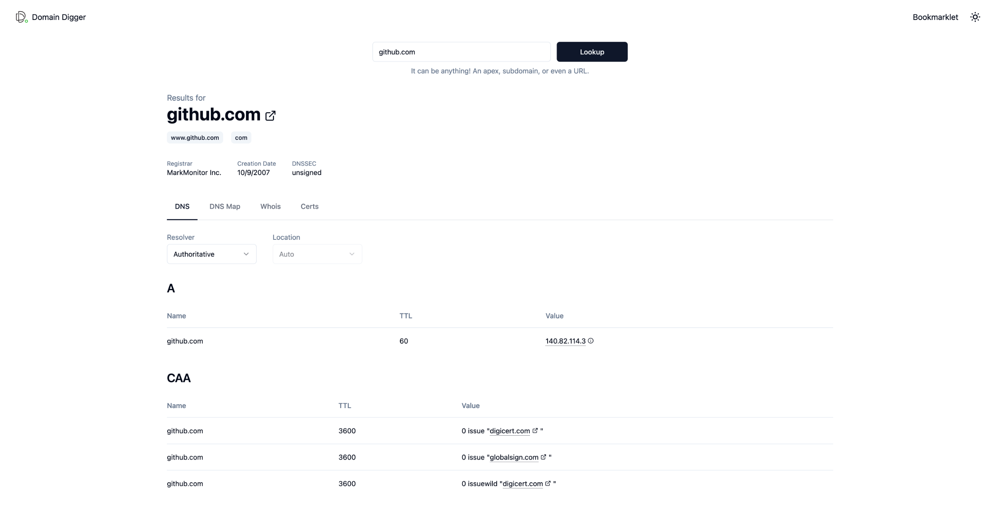
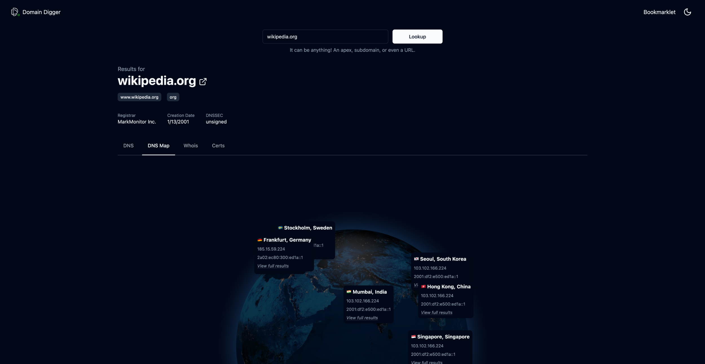
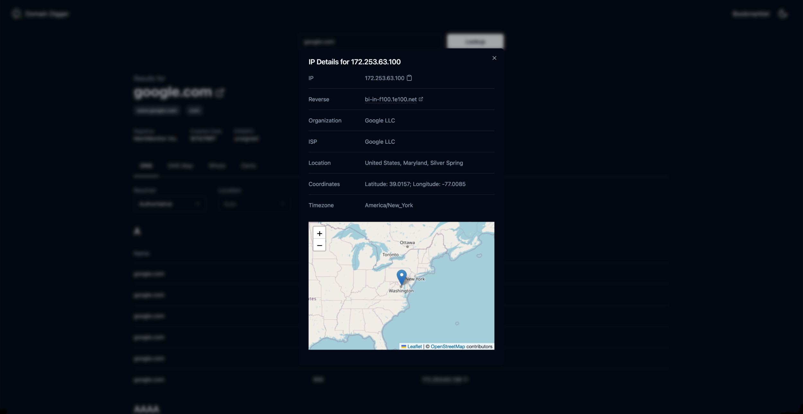
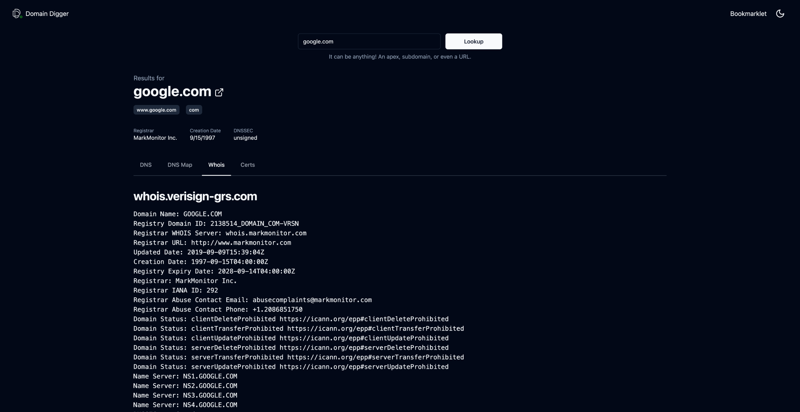

> **[We're live on DevHunt!](https://devhunt.org/tool/domain-digger) 🚀** \
> Join the conversation and help us reach the top of the leaderboard!

# 🔍 Domain Digger: Full Toolkit for Next-Level Domain Analysis

Discover in-depth details of any domain with just a few clicks.

**[🚀 Give Domain Digger a Try](https://digger.tools)**

---

## ✨ Features

- **🌍 Comprehensive DNS Lookup:** Access detailed DNS information.
- **📍 IP Details & Geolocation:** Get precise IP information including location data.
- **💡 Smart Suggestions:** Intelligent recommendations for efficient searches.
- **🔗 Global DNS Lookup:** Perform DNS lookups across different global servers.
- **🔄 Multiple DNS Resolvers:** Utilize various DNS resolvers for diverse insights.
- **🗺️ DNS Map Visualization:** Visual representation of DNS data.
- **🔍 Full & Quick WHOIS Lookup:** Rapid and detailed WHOIS data retrieval.
- **📜 Certificate History:** Track SSL/TLS certificate changes over time.
- **🔖 Quick-access Bookmarklet:** Bookmark for fast access.
- **🌓 Light and Dark Mode:** Choose your preferred theme for comfortable use.

---

## 🛠️ Built With

- **🔮 React** - A JavaScript library for building user interfaces.
- **🌟 Next.js** - A React framework for production.
- **☁️ Vercel** - Hosting and serverless functions.
- **🎨 shadcn/ui** - UI toolkit.

---

## 📸 Screenshots

|                                      |                                 |
| :----------------------------------: | :-----------------------------: |
|              DNS Lookup              |             DNS Map             |
|  |     |
|              IP Details              |          WHOIS Lookup           |
|    |  |

---

> **🤝 Contributing:** Any pull requests and contributions are very welcome. Your ideas and suggestions are greatly appreciated!
>
> **[How to run the app](./CONTRIBUTING.md)**
