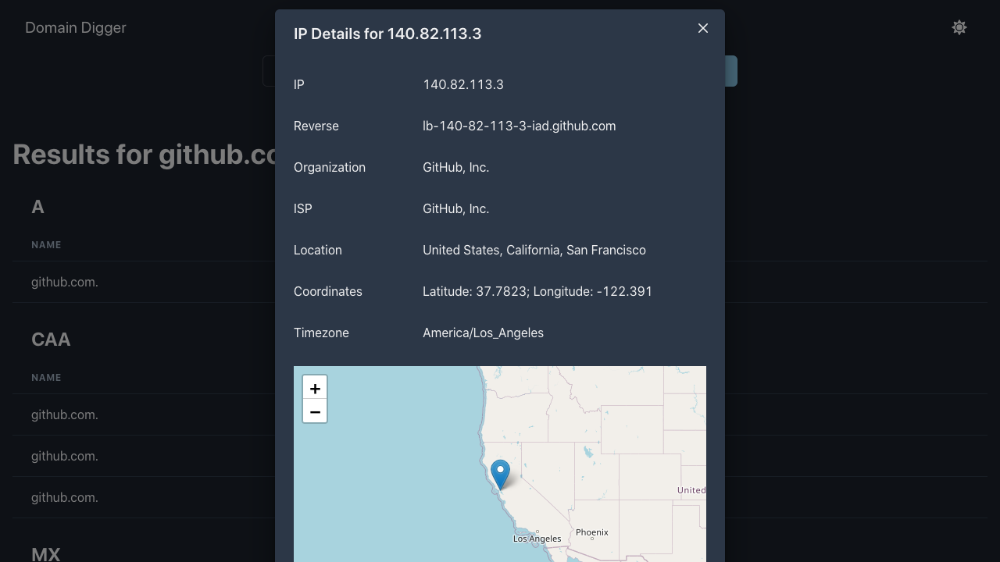

# Domain Digger

*Simple Next.js app that allows you to view various details related to a domain name.*

[Try it now!](https://domain-digger.felisk.io)

## Features

* List all DNS Records for a Domain or Subdomain
* IP Details including Geolocation (including OpenStreetMap Map)
* Whois Lookup
* Made with Chakra UI
* Light and Dark Mode

## Screenshots

*DNS Records*

*IP Details*
